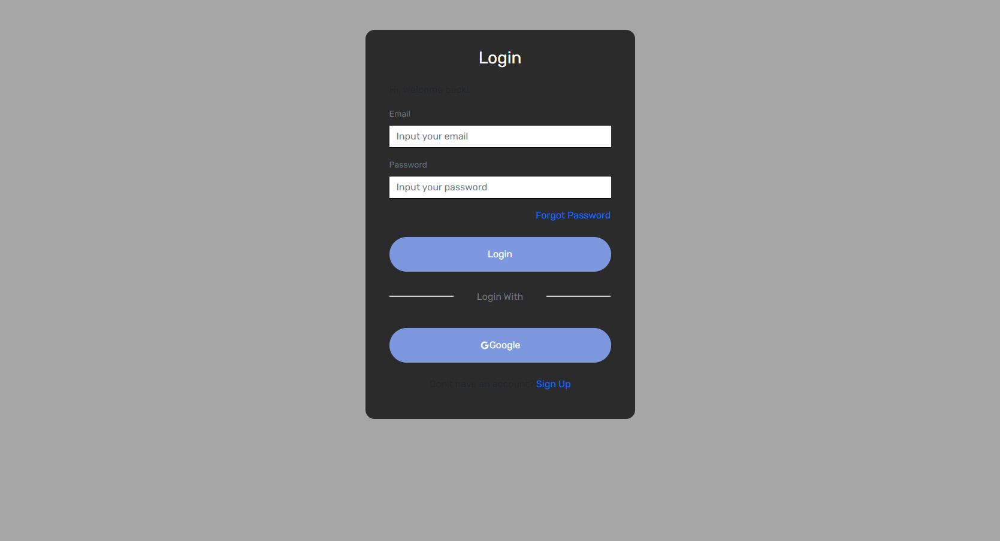

<p align="center">
<div align="center">
  
</div>
  <h3 align="center">Chatzy Frontend</h3>
  <p align="center">
    <a href="https://github.com/VerdyNordsten/chatzy_frontend"><strong>Explore the docs »</strong></a>
    <br />
    <a href="https://chatzy.digty.co.id/">View Demo</a>
    ·
    <a href="https://chatzy.up.railway.app/">Api Demo</a>
  </p>
</p>

<!-- TABLE OF CONTENTS -->

## Table of Contents

- [Table of Contents](#table-of-contents)
- [About The Project](#about-the-project)
  - [Built With](#built-with)
- [Getting Started](#getting-started)
  - [Prerequisites](#prerequisites)
  - [Requirements](#requirements)
  - [Installation](#installation)
  - [Setup .env](#setup-env)
- [Screenshots](#screenshots)
- [Related Project](#related-project)

<!-- ABOUT THE PROJECT -->

## About The Project

Chatzy is an application designed for chat purposes, allowing users to engage in conversations and connect with others online. The platform provides a user-friendly interface and various features to enhance the chatting experience.

One of the standout features of Chatzy is its versatility in creating chat rooms. Users can easily create their own personalized chat rooms or join existing ones based on their interests or specific topics. This allows users to find like-minded individuals and engage in meaningful discussions.

Chatzy also offers privacy and security features to ensure a safe chatting environment. Users can set passwords for their chat rooms, control access, and moderate conversations. This ensures that users have control over who can join their chats and helps maintain a respectful and inclusive atmosphere.

To use Chatzy, users can simply create an account or join as a guest. The application is accessible from various devices, including smartphones, tablets, and computers, making it convenient for users to chat on the go.

With Chatzy, connecting with others and having engaging conversations has never been easier. Whether for casual chats, group discussions, or collaborative work, Chatzy provides a seamless and enjoyable chatting experience for users.

<!-- GETTING STARTED -->

## Getting Started

### Prerequisites

This is an example of how to list things you need to use the software and how to install them.

- [nodejs](https://nodejs.org/en/download/)

| Third Party               | npm install                           |
| ------------------------- | ------------------------------------- |
| [@testing-library/jest-dom]     | npm i @testing-library/jest-dom@5.16.2 |
| [@testing-library/react]   | npm i @testing-library/react@12.1.3    |
| [@testing-library/user-event] | npm i @testing-library/user-event@13.5.0 |
| [axios]                   | npm i axios@0.27.2                     |
| [bootstrap]               | npm i bootstrap@5.1.3                  |
| [moment]                  | npm i moment@2.29.3                    |
| [react]                   | npm i react@17.0.2                     |
| [react-dom]               | npm i react-dom@17.0.2                 |
| [react-icons]             | npm i react-icons@4.4.0                |
| [react-modern-drawer]     | npm i react-modern-drawer@1.1.1        |
| [react-redux]             | npm i react-redux@8.0.2                |
| [react-router-dom]        | npm i react-router-dom@6.3.0           |
| [react-scripts]           | npm i react-scripts@5.0.0              |
| [react-toastify]          | npm i react-toastify@9.0.3             |
| [redux]                   | npm i redux@4.2.0                       |
| [redux-devtools-extension] | npm i redux-devtools-extension@2.13.9  |
| [redux-persist]           | npm i redux-persist@6.0.0               |
| [redux-thunk]             | npm i redux-thunk@2.4.1                 |
| [socket.io-client]        | npm i socket.io-client@4.5.1            |
| [sweetalert2]             | npm i sweetalert2@11.4.17               |
| [web-vitals]              | npm i web-vitals@2.1.4                  |

[@testing-library/jest-dom]: https://www.npmjs.com/package/@testing-library/jest-dom
[@testing-library/react]: https://www.npmjs.com/package/@testing-library/react
[@testing-library/user-event]: https://www.npmjs.com/package/@testing-library/user-event
[axios]: https://www.npmjs.com/package/axios
[bootstrap]: https://www.npmjs.com/package/bootstrap
[moment]: https://www.npmjs.com/package/moment
[react]: https://www.npmjs.com/package/react
[react-dom]: https://www.npmjs.com/package/react-dom
[react-icons]: https://www.npmjs.com/package/react-icons
[react-modern-drawer]: https://www.npmjs.com/package/react-modern-drawer
[react-redux]: https://www.npmjs.com/package/react-redux
[react-router-dom]: https://www.npmjs.com/package/react-router-dom
[react-scripts]: https://www.npmjs.com/package/react-scripts
[react-toastify]: https://www.npmjs.com/package/react-toastify
[redux]: https://www.npmjs.com/package/redux
[redux-devtools-extension]: https://www.npmjs.com/package/redux-devtools-extension
[redux-persist]: https://www.npmjs.com/package/redux-persist
[redux-thunk]: https://www.npmjs.com/package/redux-thunk
[socket.io-client]: https://www.npmjs.com/package/socket.io-client
[sweetalert2]: https://www.npmjs.com/package

### Installation

- Clone This Front End Repo

```
git clone https://github.com/VerdyNordsten/chatzy_frontend
```

- Go To Folder Repo

```
cd chatzy_frontend
```

- Install Module

```
npm install
```

- <a href="#setup-env">Setup .env</a>
- Type ` npm run dev` To Start Website
- Type ` npm run production` To Start Production

### Setup .env

Create .env file in your root project folder.

```
REACT_APP_APP_NAME=
REACT_APP_NODE_ENV=
REACT_APP_API_URL=
```

<!-- ROADMAP -->

## Screenshots

<table>
<div align="center">
  <tr>
    <td></td>
  </tr>
  <tr>
    <td>Chat Page</td>
  </tr>
  <tr>
    <td> </td>
  </tr>
  <tr>
    <td>Login</td>
  </tr>
  <tr>
    <td> </td>
  </tr>
  <tr>
    <td>Register</td>
  </tr>
  <tr>
    <td> </td>
  </tr>
  <tr>
    <td>My Profile</td>
  </tr>
  <tr>
    <td> </td>
  </tr>
  <tr>
    <td>Profile User</td>
  </tr>
</div>
</table>

## Related Project

:rocket: [`Backend Chatzy`](https://github.com/VerdyNordsten/chatzy_backend)

:rocket: [`Frontend Chatzy`](https://github.com/VerdyNordsten/chatzy_frontend)

:rocket: [`Demo Chatzy`](https://chatzy.digty.co.id/)

Project Link: [https://github.com/VerdyNordsten/chatzy_frontend](https://github.com/VerdyNordsten/chatzy_frontend)